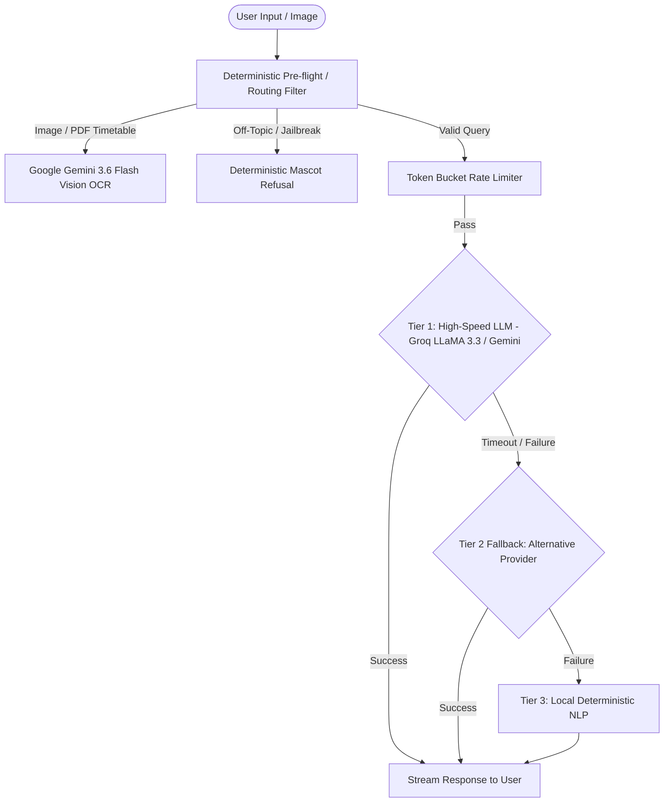

# Artificial Intelligence & LLM Architecture

> [!INFO] **AI Core Philosophy**
> Across the entire portfolio, applications utilize context-aware, empathetic, and hardened conversational AI agents designed to provide domain-specific assistance while resisting prompt injection, jailbreaks, and cost abuse.

---

## AI Routing & Resilience Matrix

---

## Comparative Implementations

| Feature Dimension | **Pawi Financial Tracker** | **Capy Companion** | **Dormosaur Campus Companion** |
| :--- | :--- | :--- | :--- |
| **Agent Persona** | Pawi the Sea Turtle (Disciplined, compounding mentor) | Capy the Capybara (Calm, grounding, emotionally validating) | Dormosaur the Dino (Witty, energetic college senior tutor) |
| **Primary Engine** | Groq (LLaMA 3.3 70B / Qwen 2.5) | Google Gemini 3.7 / 2.5 Flash | Groq LLaMA 3.3 70B + Gemini 3.6 Flash Vision |
| **Multimodal Capabilities** | Live Camera QR Scanner + Receipt OCR | N/A (Text reflection) | Visual Timetable OCR + Syllabus Deadline Parser |
| **Domain Logic** | Budgeting, multi-wallet transfers, savings streaks | Mood journals, box breathing, mindful travel | Class gaps, dorm appliance recipes, smart wake alarms |
| **Rate Limiting** | 20 requests / hour / user | Session-based throttling | Token-conscious stream caching |

---

## Projects Implementing AI
- [[Pawi — AI-Powered Personal Finance Tracker — Complete Project Architecture & Knowledge Base|Pawi: AI-Powered Personal Finance Tracker]]
- [[Capy — Deep Project Architecture & System|Capy: Cozy AI Mood & Travel Companion]]
- [[Dormosaur — AI-Powered Student Campus & Dorm Companion — Complete Project Architecture & Knowledge Base|Dormosaur: AI-Powered Student Campus & Dorm Companion]]

---

## Related Hubs
- [[Next.js]]
- [[PostgreSQL]]
- [[Home|Projects Dashboard]]
