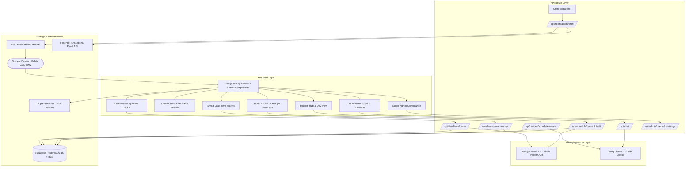
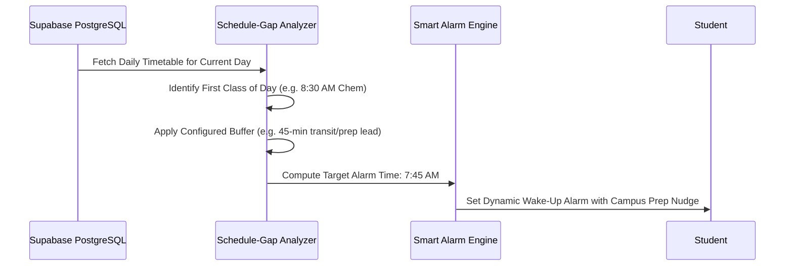
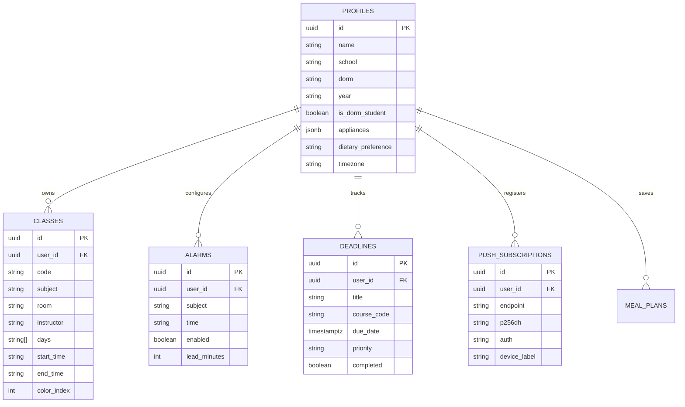

# Dormosaur: AI-Powered Student Campus & Dorm Companion — Complete Project Architecture & Knowledge Base

> [!INFO] **Obsidian Document Metadata**
> - **Project**: Dormosaur (formerly Dormly)
> - **Mascot**: Dormosaur the Dinosaur (*"Smart campus living, extinct stress"*)
> - **Primary Target Market**: University & College dormers, commuter students, and academic residences worldwide
> - **Platforms**: Next.js 16 (App Router + React 19 PWA), Mobile Web, Web-Push Native Service Worker
> - **Backend / DB**: Supabase (PostgreSQL 15 + RLS + Auth + SSR) & Direct PG Connection Pooling
> - **AI Systems**: Multimodal Google Gemini 3.6 Flash (Vision Schedule & Syllabus OCR) + Groq LLaMA 3.3 70B (Dormosaur Copilot & Schedule-Aware Recipe Generation)
> - **Communications**: Web-Push (VAPID / P256DH) + Resend Email Delivery Engine
> - **Repository**: [`janveryuu/dormosaur`](https://github.com/janveryuu/dormosaur)

---

## Table of Contents
1. [[#1. Executive Summary & Brand Identity]]
2. [[#2. System Architecture & High-Level Topology]]
3. [[#3. Multimodal Vision Schedule & Timetable Parser (Gemini 3.6 Flash)]]
4. [[#4. Smart Alarms & Class-Lead Wake-Up Engine]]
5. [[#5. Academic & Dorm Deadlines Management (OCR Syllabus Parser)]]
6. [[#6. Dorm Kitchen & Schedule-Aware Meal Planning]]
7. [[#7. Dormosaur Copilot: Context-Grounded AI Campus Assistant]]
8. [[#8. Push Notification Engine & Weekly Resend Digests]]
9. [[#9. Super Admin Suite & Governance Portal]]
10. [[#10. Database Schema & PostgreSQL Topology (Supabase)]]
11. [[#11. Design System & Mascot Animation (Tailwind CSS 4)]]
12. [[#12. Cross-Ecosystem Synergy (Pawi, Capy & Dormosaur)]]

---

## 1. Executive Summary & Brand Identity

> [!NOTE] **Core Mission**
> University dorm life is notoriously overwhelming: fragmented portal timetables, erratic wake-up schedules, missing syllabus deadlines, and poor nutrition from limited dorm appliances (microwaves, air fryers, kettles). **Dormosaur** solves this by consolidating academic schedules, dynamic wake-up alarms, smart grocery meal planning, and an empathetic campus AI copilot into a unified, mascot-guided platform.

### Mascot Symbolism: Dormosaur the Dino
- **Personality**: Energetic, witty, hyper-organized, and street-smart university dinosaur.
- **Tone**: Encouraging peer mentor that helps students "crush deadlines before they go extinct."
- **Visuals**: Vibrant campus green, student lanyard accents, backpack, and dynamic emotional reaction states across dashboard widgets.

---

## 2. System Architecture & High-Level Topology



---

## 3. Multimodal Vision Schedule & Timetable Parser (Gemini 3.6 Flash)

Students upload messy screenshots or camera photos of their university student portal timetables, PDF printouts, or registration forms. Dormosaur parses them directly into structured schedule entities.

### Extraction Pipeline:
1. **Multi-Format Classifier**:
   - **Day-Grouped Stacked Cards** (e.g. `7:00am - 10:00am (Food Chem/Even-Lab 2)` under `MON`).
   - **2D Timetable Grids** (Days as column headers, time slots as row axes).
   - **Unstructured Course Lists** (Course codes, room assignments, instructor names).
2. **Deterministic Sanitizer**:
   - Strips parentheses, splits subject from room using delimiters (`/`, `-`, `RM`).
   - Prevents Day Headers (`THURS`, `MON`) from accidentally becoming course titles.
   - Normalizes military time (`13:00`) to human AM/PM formatting.
3. **Interactive Review Matrix**:
   - After parsing, the student is routed to `/(main)/schedule/review` to visually verify, adjust subject color tags, or edit room numbers before saving to PostgreSQL.

---

## 4. Smart Alarms & Class-Lead Wake-Up Engine

Static phone alarms fail university students because class schedules change every single day.



### Key Capabilities:
- **Lead-Time Customization**: Set individual transit buffers per class (e.g. 15 mins for online zoom classes, 60 mins for cross-campus labs).
- **Smart-Nudge API (`/api/alarms/smart-nudge`)**: Generates witty motivational reminders based on the day's specific coursework.
- **Sleep Deficit Warnings**: Alerts students if their bedtime conflicts with tomorrow morning's earliest lecture.

---

## 5. Academic & Dorm Deadlines Management (OCR Syllabus Parser)

Students can photograph course syllabi or assignment sheets. Dormosaur extracts:
- **Assignment / Exam Title**
- **Course Code Correlation** (matches to active enrolled timetable subjects)
- **Due Date & Time**
- **Weight / Priority Level** (`High`, `Medium`, `Low`)

Features include countdown tickers, calendar sync (iCal / `.ics` export via `lib/ical.ts`), and notification reminders 24 hours and 2 hours before due dates.

---

## 6. Dorm Kitchen & Schedule-Aware Meal Planning

One of Dormosaur's most innovative modules: **solving student nutrition in dorm rooms without full kitchens**.

### 1. Appliance-Constrained Cooking
Students configure their exact dorm room appliances:
- Microwave
- Air Fryer
- Electric Kettle
- Single Induction Cooker
- Rice Cooker
- Mini Fridge

### 2. Schedule-Aware Meal Recommendation (`/api/recipes/schedule-aware`)
Dormosaur looks at the student's timetable gaps:
> *"You have a 40-minute gap between Physics (ends 11:30 AM) and Calc (starts 12:10 PM). Here is a 12-minute High-Protein Air Fryer Tuna Melt you can make with your pantry staples!"*

### 3. Integrated Grocery & Pantry Checklist
Tracks essential dorm ingredients (eggs, bread, canned tuna, oats, instant ramen hacks) and generates exportable shopping lists.

---

## 7. Dormosaur Copilot: Context-Grounded AI Campus Assistant

Powered by **Groq LLaMA 3.3 70B** with real-time temporal and relational grounding.

```text
System Prompt Context Injection:
- Current Time: Saturday, Sept 5, 2026, 2:15 AM
- Enrolled Classes: [Chem 101, Phys 202, CS 50]
- Today's Schedule: [Next class at 9:00 AM in Science Hall 304]
- Active Alarms: [8:00 AM with 60-min buffer]
- Upcoming Deadlines: [Physics Problem Set 3 due in 18 hours]
- Dorm Appliances: [Microwave, Kettle, Mini Fridge]
```

### Scope & Guardrails:
- **Direct Real-Time Answers**: Answers queries like *"Where is my next class?"*, *"What time should I wake up tomorrow?"*, *"What can I cook in 15 mins?"*.
- **Tone**: Witty, organized campus mascot that speaks like an empathetic college senior.
- **Zero Hallucination Grounding**: If the student has no classes on Friday, it confirms a free day rather than inventing fictitious lectures.

---

## 8. Push Notification Engine & Weekly Resend Digests

- **Web Push Notifications**: Leverages `web-push` (VAPID keys) with native browser service workers. Triggers alarms, class departure reminders, and deadline warnings directly to mobile lock screens.
- **Weekly Digest (`/api/digest/weekly`)**: Powered by **Resend** (`resend`). Sends every Sunday evening with:
  - Upcoming week's lecture timetable
  - High-priority exam & assignment countdowns
  - Suggested meal plan & grocery prep list

---

## 9. Super Admin Suite & Governance Portal

Located at `/app/admin`:
- **User Activity Audit Log**: Real-time tracking of sign-ups, schedule imports, OCR events, and device tokens.
- **Global Recipe Registry**: Curate, tag, and approve community dorm recipes.
- **Country & University Configurations**: Support for localized academic terms, time zones, and university portal layouts.
- **System Health & AI Quotas**: Real-time monitoring of Gemini Vision API and Groq token consumption.

---

## 10. Database Schema & PostgreSQL Topology (Supabase)



---

## 11. Design System & Mascot Animation (Tailwind CSS 4)

- **Palette**: Campus Dinosaur Emerald (`#059669`), Forest Slate (`#0f172a`), Energetic Amber (`#f59e0b`).
- **Animations**: Fluid Framer Motion transitions (`framer-motion 13`) for timetable day sliding and deadline card completions.
- **Typography & Components**: Clean modern typography using `@base-ui/react` primitives and Lucide React icons.

---

## 12. Cross-Ecosystem Synergy (Pawi, Capy & Dormosaur)

Together, **Pawi**, **Capy**, and **Dormosaur** form an extraordinary trio of companion applications created by **Janver Yu**:

```mermaid
graph LR
    User([Modern Young Adult / Student])
    
    User --> Pawi[Pawi Financial Tracker]
    User --> Capy[Capy Wellness Companion]
    User --> Dorm[Dormosaur Campus Companion]
    
    Pawi -. Finances .-> Wallet[(Savings & Wealth)]
    Capy -. Mental Health .-> Mind[(Mood, Breathing & Travel)]
    Dorm -. Academics & Living .-> Campus[(Timetable, Food & Alarms)]
    
    subgraph Unified Tech Standard
        NextJS[[Next.js]]
        PG[[PostgreSQL]]
        AI[[Artificial Intelligence & LLMs]]
        Tailwind[[Tailwind CSS]]
    end
    
    Pawi === Unified Tech Standard
    Capy === Unified Tech Standard
    Dorm === Unified Tech Standard
```

---

## Related Knowledge Hubs
- [[Home|Central Projects Dashboard]]
- [[Next.js]] — App Router, Server Actions, PWA
- [[PostgreSQL]] — Supabase RLS, Database Schemas
- [[Artificial Intelligence & LLMs]] — Gemini Vision & Groq Copilot
- [[Tailwind CSS]] — Design System & Tokens
- [[Mobile Applications & TWA]] — PWA & Web Push
- [[Pawi — AI-Powered Personal Finance Tracker — Complete Project Architecture & Knowledge Base|Pawi Financial Tracker]]
- [[Capy — Deep Project Architecture & System|Capy Mood & Travel Companion]]
