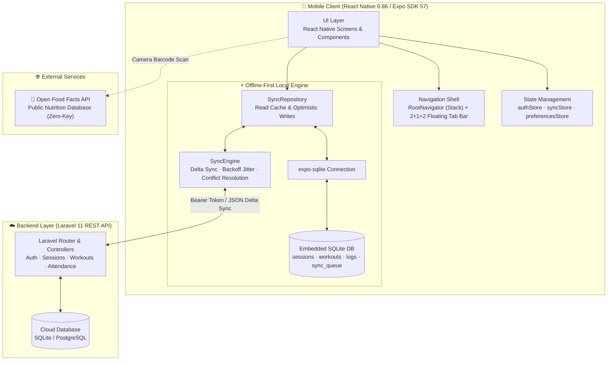

# **🏋️ GymFlow — Offline-First Member-Facing Fitness Companion** — Complete Project Architecture & Knowledge Base

> [!ABSTRACT] Executive Summary
> **GymFlow** is an enterprise-grade member companion mobile application designed for premium gym members, boutique fitness clubs, and athletic trainers. Built from the ground up for high-intensity gym environments where cellular and Wi-Fi networks fail, GymFlow operates with an **offline-first local persistence architecture** powered by an embedded SQLite engine.
> 
> The application features an ergonomic **2+1+2 floating action tab bar** (Home, Workouts, Action Hub `+`, Progress, Profile), an **interactive weekly schedule & check-in module on Home**, a **real-time camera barcode scanner** connected to the Open Food Facts nutritional database, **300+ synced animated workout execution guides**, a **smart hydration tracking engine**, and an **AI fitness coach**.

---

## 📑 Table of Contents

1. [[#🌐 System Architecture & High-Level Topology]]
2. [[#🛠️ Technology Stack & Dependencies]]
3. [[#📂 Repository & Monorepo Structure]]
4. [[#🗄️ Offline-First SQLite Architecture & Sync Engine]]
5. [[#🎨 Brand Identity, UI/UX Design System & Ergonomics]]
6. [[#⚡ Core Feature Deep Dive]]
   - [[#1. Interactive 7-Day Week Schedule & One-Tap Check-In]]
   - [[#2. Barcode Food Scanner & Macro Tracker (Open Food Facts)]]
   - [[#3. Workout Catalog & 300+ Synced Biomechanical Guides]]
   - [[#4. Smart Hydration & Water Intake Engine]]
   - [[#5. AI Coach & Multimodal Food Scanner]]
   - [[#6. 2+1+2 Ergonomic Balanced Floating Navigation Bar]]
7. [[#🔐 Authentication, Session Security & Password Reset Guardrails]]
8. [[#📜 API Contracts & Sync Specification]]
9. [[#🚀 Developer Setup & Environment Configuration]]
10. [[#🧪 Quality Assurance & Test Verification]]

---

## 🌐 System Architecture & High-Level Topology



---

## 🛠️ Technology Stack & Dependencies

### Mobile Application (`mobile/`)
* **Framework:** React Native `0.86.3`, Expo SDK `57.0.20`
* **Language:** TypeScript `5.8.0` (Strict compilation)
* **Local Storage & Database:** `expo-sqlite ~57.0.2` (ACID local-first persistence)
* **Secure Storage:** `expo-secure-store ~57.0.3` (Keychain / Android Keystore for JWT tokens)
* **Camera & Hardware Sensors:** `expo-camera ~57.0.4` (Barcode scanning), `expo-haptics ~57.0.2`
* **Navigation:** React Navigation v7 (`@react-navigation/native-stack`, `@react-navigation/bottom-tabs`)
* **Icons & Visuals:** `lucide-react-native ^1.41.0`, `victory-native ^42.0.1` (Charts), `@shopify/flash-list 2.0.2`
* **State Management:** Zustand `5.0.15`
* **Testing:** Jest `29.7.0`, `@testing-library/react-native 14.0.1`, Detox `20.51.4` (E2E)

### Backend API (`backend/`)
* **Framework:** Laravel 11.x (PHP 8.2+)
* **Authentication:** Laravel Sanctum token guard with forced password change validation
* **Database:** SQLite (local development) / PostgreSQL (production)
* **Testing:** PHPUnit

---

## 📂 Repository & Monorepo Structure

```
GymFlow/
├── assets/
│   ├── brand/               # Brand squircle logo, wordmarks, official banner
│   └── screenshots/         # Production screenshots & feature showcases
├── backend/                 # Laravel 11 API Backend
│   ├── app/                 # Controllers, Models (GymSession, Attendance, MemberPreference)
│   ├── database/            # Migrations & Seeders
│   └── routes/api.php       # Protected & public API endpoints
├── docs/                    # Architectural specifications and test infrastructure logs
├── mobile/                  # React Native / Expo Frontend Application
│   ├── assets/              # App icons, workout guide animation packs
│   ├── scripts/             # syncWorkoutAssets.js asset pipeline
│   ├── src/
│   │   ├── api/             # Axios client with 401 pause/token refresh interceptors
│   │   ├── components/      # GymTabBar, GymFlowBrand, PercentRing, QuickActionsSheet
│   │   ├── db/              # SQLite connection, schema migrations, mappers
│   │   ├── navigation/      # RootNavigator, types.ts
│   │   ├── screens/         # Dashboard, Catalog, Schedule, Progress, Profile, BarcodeScanner
│   │   ├── store/           # authStore, syncStore, devMockStore
│   │   ├── sync/            # SyncEngine, SyncRepository, workoutMerge
│   │   ├── theme/           # Athletic dark color palette, typography, layout tokens
│   │   └── types/           # Core domain models, Session, Workouts, API responses
│   └── App.tsx              # Root component wrapped with SafeAreaProvider & NavigationContainer
├── tests/                   # Monorepo Tier 1 - Tier 4 E2E test suites
├── CONTRACT.md              # Cross-platform data contract and REST payload formats
├── PROJECT.md               # Design system rules, constraints, and architecture guidelines
└── README.md                # Public GitHub repository documentation
```

---

## 🗄️ Offline-First SQLite Architecture & Sync Engine

GymFlow treats the embedded SQLite database as the single source of truth for the UI:

### Local SQLite Tables (`mobile/src/db/schema.ts`)
1. `sessions`: Cached trainer sessions, group classes, start times, locations, status.
2. `workouts`: Full catalog of exercise definitions, muscle groups, equipment, and duration.
3. `workout_logs`: Sets, reps, weights, rest intervals completed by the athlete.
4. `sync_queue`: Ordered queue of outbound mutations (`POST`, `PUT`, `DELETE`) with retry counts and backoff timestamps.
5. `metadata`: Stores `last_sync_timestamp`, cache TTL flags, and sync watermarks.

### Sync Pipeline & Conflict Management
* **Deterministic UUIDs:** Every record created locally receives a `UUIDv4` idempotency key to guarantee server retries never produce duplicate entries.
* **Delta Synchronization:** On reconnect, the `SyncEngine` drains `sync_queue` FIFO.
* **409 Conflict Handling:** If another member or the gym administrator cancels or updates a session while offline, the backend returns an HTTP 409 conflict payload. The sync store flags the conflict on the active notification banner while reconciling local state cleanly.

---

## 🎨 Brand Identity, UI/UX Design System & Ergonomics

### The GymFlow Visual Identity
* **Emblem:** The GymFlow dumbbell badge features a high-contrast white athletic monogram set on a solid black squircle background (`1254x1254` 1:1 aspect ratio), ensuring razor-sharp contrast against light and dark surfaces alike.
* **Typography:** Bold, energetic sans-serif heading hierarchy paired with functional monospaced metrics.

### Color Palette
* **Canvas Background:** `#0F0F10` (Surgical midnight charcoal)
* **Card Surface:** `#1C1C1E` (Subtle elevation)
* **Surface Elevated:** `#2C2C2E` (Interactive chips & secondary cards)
* **Primary Accent:** `#CCFF00` (Electric Lime — high visibility and focus)
* **Text Primary:** `#FFFFFF` (Max contrast headings)
* **Text Muted:** `#8E8E93` (Secondary metadata)
* **Alert / Warning:** `#FF453A` (Error badges & conflict alerts)

---

## ⚡ Core Feature Deep Dive

### 1. Interactive 7-Day Week Schedule & One-Tap Check-In
Relocated directly onto the **Home Screen (`DashboardScreen.tsx`)**:
* **Week Strip:** Mon–Sun date selector pills with active day highlights and indicator dots for scheduled classes.
* **One-Tap Check-In:** If a session is scheduled for today, an interactive check-in button triggers haptic feedback, updates attendance locally in SQLite, and pushes to the backend.
* **Full Calendar Navigation:** Seamlessly launches `ScheduleScreen` for full booking and cancellation workflows.

### 2. Barcode Food Scanner & Macro Tracker (Open Food Facts)
* Accessed instantly via the `+` center action button or Nutrition screen.
* Uses `expo-camera` (`CameraView`) with real-time barcode detection.
* Queries the **Open Food Facts API** (`https://world.openfoodfacts.org/api/v2/product/{barcode}.json`).
* Parses energy (kcal), protein (g), carbohydrates (g), and fat (g) directly into member dietary logs.

### 3. Workout Catalog & 300+ Synced Biomechanical Guides
* Filter workouts by muscle group (Chest, Back, Legs, Core, Arms), equipment, or difficulty.
* Synced via `@bryllim/workout-guide` asset pipeline directly to local bundle.

### 4. Smart Hydration & Water Intake Engine
* Calculates baseline hydration: `weight_kg * 35ml + workout_duration_min * 12ml`.
* Quick-add buttons (250ml, 500ml) with instant visual progress bars.

### 5. 2+1+2 Ergonomic Balanced Floating Navigation Bar
* **Left:** `Home` · `Workouts`
* **Center Action Hub:** Elevated black circular `+` button opening instant actions (Schedule & Classes, Nutrition, Barcode Scanner, AI Food Scanner, Water Intake, AI Coach).
* **Right:** `Progress` · `Profile`
* Eliminates overcrowding and prevents tab misclicks on standard mobile viewports.

---

## 🔐 Authentication, Session Security & Password Reset Guardrails

* **Persistent Auth:** Tokens stored via `expo-secure-store`.
* **Forced Password Reset:** If a newly onboarded user has `must_change_password: true`, navigation is strictly trapped in `ForcedPasswordResetScreen` until new credentials pass validation.
* **Automatic 401 Pause:** If a token expires during an offline-to-online sync, the sync queue pauses immediately to prevent cascading request failures.

---

## 🚀 Developer Setup & Environment Configuration

### Quickstart Commands

```bash
# 1. Clone the repository
git clone https://github.com/janveryuu/GymFlow.git
cd GymFlow

# 2. Run the Mobile App
cd mobile
npm install --legacy-peer-deps
npm run typecheck
npm test
npx expo start -c

# 3. Run the Backend API
cd ../backend
composer install
cp .env.example .env
php artisan key:generate
php artisan migrate --seed
php artisan serve --host=0.0.0.0 --port=8000
```

---

## 🧪 Quality Assurance & Test Verification

* **Unit & Component Tests:** 12 Jest suites with **133 passed tests** (`npm test`).
* **TypeScript Compilation:** Zero errors (`npm run typecheck`).
* **E2E Test Harness:** Verified with deterministic mock servers and SQLite storage simulation (`tests/e2e`).
