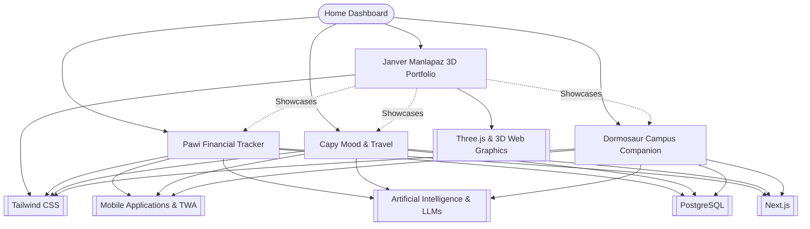

# Engineering Knowledge Base & Projects Dashboard

> [!NOTE] **Mission & Architecture Philosophy**
> A unified second-brain knowledge repository documenting full-stack, AI-native, and creative 3D web applications built by **Janver P. Manlapaz**. Focused on **interactive 3D graphics**, **offline-first resilience**, **mascot-driven user interfaces**, **defensive AI guardrails**, and **native mobile packaging**.

---

## Active Applications & Flagship Projects

| Project | Category | Mascot / Theme | Core Tech Stack | Status | Documentation & Quick Links |
| :--- | :--- | :--- | :--- | :---: | :--- |
| **Janver Manlapaz 3D Portfolio** | Flagship Showcase / Creative Dev | Cyberpunk 3D / Interactive Chess | React 18, Three.js, R3F, Rapier Physics, Stockfish, GSAP, Lenis | `v1.0.0 Active` | [[Janver Manlapaz — 3D Interactive Developer Portfolio — Complete Project Architecture & Knowledge Base\|Portfolio Documentation]] [GitHub Repo](https://github.com/janveryuu/JanverManlapaz-Portfolio) · [Live Showcase](https://janver-manlapaz.vercel.app/) |
| **Pawi Financial Tracker** | Full Stack / FinTech SaaS | Pawi the Pawikan (*Compound savings*) | Next.js 16, Supabase, Groq/Gemini, Android TWA | `v2.0.1 Active` | [[Pawi — AI-Powered Personal Finance Tracker — Complete Project Architecture & Knowledge Base\|Pawi Documentation]] [GitHub Repo](https://github.com/janveryuu/pawi-financial-tracker) · [APK Release](https://github.com/janveryuu/pawi-financial-tracker) |
| **Capy Mood & Travel** | Full Stack / HealthTech | Capy the Capybara (*Calm wellness companion*) | Next.js 16, React 19, Prisma, PostgreSQL, Gemini | `v1.0.0 Active` | [[Capy — Deep Project Architecture & System\|Capy Documentation]] [GitHub Repo](https://github.com/janveryuu/capy-app) · [Web App](https://capy-app-fawn.vercel.app/) |
| **Dormosaur Campus Companion** | Full Stack / EdTech AI | Dormosaur the Dino (*Smart campus living*) | Next.js 16, Supabase, Gemini 3.6 Flash, Groq, Web Push | `v0.1.0 Active` | [[Dormosaur — AI-Powered Student Campus & Dorm Companion — Complete Project Architecture & Knowledge Base\|Dormosaur Documentation]] [GitHub Repo](https://github.com/janveryuu/dormosaur) · [Web App](https://dormosaur.vercel.app/) |

---

## Ecosystem Knowledge Graph

---

## Core Technology Hubs
- [[Three.js & 3D Web Graphics]] — WebGL render pipelines, React Three Fiber, Rapier WASM physics, and Stockfish AI chess
- [[Next.js]] — App Router, Server Components, Route Handlers & Serverless architecture
- [[PostgreSQL]] — Supabase RLS, Prisma ORM, transactional ledger consistency
- [[Artificial Intelligence & LLMs]] — Tiered Groq / Gemini fallbacks, multimodal OCR, deterministic prompt injection guardrails
- [[Mobile Applications & TWA]] — Trusted Web Activities, Gradle build scripts, camera and sensor bridges, Web Push
- [[Tailwind CSS]] — Design systems, responsive layouts, color tokens, and SVG icon standards

---

## Interactive Visual Canvas Boards
- [[Pawi Architecture.canvas|Open Pawi Visual Canvas Board]] — Interactive whiteboard with architecture blocks, database topologies, and QA checklists.

---

## Global Repository Synchronization
* **Knowledge Vault**: [janveryuu/knowledge-based](https://github.com/janveryuu/knowledge-based) (Auto-synced via Obsidian Git)
* **3D Portfolio**: [janveryuu/JanverManlapaz-Portfolio](https://github.com/janveryuu/JanverManlapaz-Portfolio)
* **Pawi Repository**: [janveryuu/pawi-financial-tracker](https://github.com/janveryuu/pawi-financial-tracker)
* **Capy Repository**: [janveryuu/capy-app](https://github.com/janveryuu/capy-app)
* **Dormosaur Repository**: [janveryuu/dormosaur](https://github.com/janveryuu/dormosaur)
