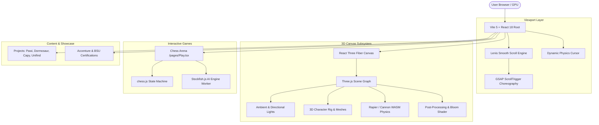
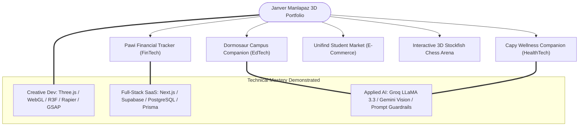

# Janver Manlapaz: 3D Interactive Developer Portfolio — Complete Project Architecture & Knowledge Base

> [!INFO] **Obsidian Document Metadata**
> - **Project**: Janver Manlapaz Portfolio (`janver-portfolio`)
> - **Creator**: Janver P. Manlapaz — Full-Stack Developer & AI Systems Engineer
> - **Focus**: Creative Web Engineering, Interactive 3D Graphics, Physics Simulations & High-Performance UI
> - **Core Stack**: React 18, Vite 5, Three.js, React Three Fiber (R3F), Rapier / Cannon Physics, GSAP, Lenis Smooth Scroll
> - **Interactive Mini-Games**: Full-Featured 3D/2D Chess Arena powered by Stockfish AI Engine (`stockfish.js` & `chess.js`)
> - **Repository**: [`janveryuu/JanverManlapaz-Portfolio`](https://github.com/janveryuu/JanverManlapaz-Portfolio)

---

## Table of Contents
1. [[#1. Executive Summary & Creative Vision]]
2. [[#2. System Architecture & 3D WebGL Pipeline]]
3. [[#3. 3D Interactive Character & Physics Simulation (R3F + Rapier)]]
4. [[#4. Stockfish AI Chess Arena (Play.tsx Engine)]]
5. [[#5. Motion Design & Scroll Choreography (GSAP + Lenis)]]
6. [[#6. Flagship Projects Showcase Matrix]]
7. [[#7. Certifications & Technical Credentials]]
8. [[#8. Performance Engineering & GPU Optimization]]
9. [[#9. Portfolio as the Central Showcase of the Ecosystem]]

---

## 1. Executive Summary & Creative Vision

> [!NOTE] **Design Philosophy**
> Unlike traditional static resume websites, **Janver Manlapaz's Portfolio** is designed as an immersive, tactile digital experience. It demonstrates mastery over both **rigorous full-stack systems engineering** (SaaS, PostgreSQL, AI APIs) and **bleeding-edge creative frontend development** (WebGL shaders, real-time WASM physics, and smooth scroll choreography).

### Key Themes:
- **Cyberpunk / Deep Violet Aesthetics**: Dark theme with neon violet (`#c2a4ff`), deep obsidian black (`#1a1a2e`), and smooth ambient glow.
- **Gamified Interactivity**: Custom cursor physics, draggable 3D character elements, and an in-browser chess battle arena against the Stockfish AI engine.
- **Comprehensive Showcase**: Unifies Janver's SaaS and AI applications (**Pawi**, **Dormosaur**, **Capy**, and **Unifind**) into a coherent narrative.

---

## 2. System Architecture & 3D WebGL Pipeline

---

## 3. 3D Interactive Character & Physics Simulation (R3F + Rapier)

Located in `src/components/Character/`:
- **Canvas Orchestration (`Scene.tsx`)**: Sets up the WebGL viewport using `@react-three/fiber` and `@react-three/drei`.
- **Physics Integration (`@react-three/rapier` & `@react-three/cannon`)**:
  - Implements rigid-body physics for floating, collision-reactive elements.
  - Interactive ragdoll/character mechanics responding to user mouse hover and drag gestures.
- **Lighting & Shader Pass**: Directional spotlights casting soft shadows combined with post-processing bloom for a signature futuristic glow.

---

## 4. Stockfish AI Chess Arena (`Play.tsx`)

Located at `/play` (`src/pages/Play.tsx`):
A playable, fully interactive chess game integrated directly into the portfolio:
- **Engine Core**: WebAssembly/JavaScript build of **Stockfish 10** (`stockfish.js`) running in a Web Worker for multi-threaded move evaluation without UI lag.
- **Game State Machine**: `chess.js` enforcing legal moves, checkmate detection, en passant, promotion, and FEN string serialization.
- **Custom Visuals**: Custom-crafted SVG piece set styled in cream (`#ffffff`) and violet-accented dark obsidian (`#1a1a2e` with `#c2a4ff` strokes).
- **Move History & Evaluation**: Displays SAN notation, captured pieces, and move-by-move status indicators.

---

## 5. Motion Design & Scroll Choreography (GSAP + Lenis)

- **Lenis Smooth Scroll (`lenis`)**: Intercepts browser wheel and touch events to provide inertia-based 60 FPS smooth scrolling.
- **GSAP ScrollTrigger (`gsap`)**:
  - Parallax text and project card unveilings.
  - Pinned landing sections with dynamic scale transforms.
  - Fast-marquee tech stack banners (`react-fast-marquee`).
- **Interactive Cursor (`src/components/Cursor.tsx`)**: Custom trailing physics dot that expands and morphs when hovering over clickable links, buttons, and work cards.

---

## 6. Flagship Projects Showcase Matrix

| Project | Category | Mascot & Core Identity | Tech Stack | Live Demo |
| :--- | :--- | :--- | :--- | :--- |
| **[[Pawi — AI-Powered Personal Finance Tracker — Complete Project Architecture & Knowledge Base\|Pawi]]** | Full Stack / Fintech SaaS | Pawi the Pawikan (*Slow & steady savings*) | Next.js 16, Supabase, Groq/Gemini, Android TWA | [pawi-finance.vercel.app](https://pawi-finance.vercel.app/) |
| **[[Dormosaur — AI-Powered Student Campus & Dorm Companion — Complete Project Architecture & Knowledge Base\|Dormosaur]]** | Full Stack / EdTech AI | Dormosaur the Dino (*Smart campus living*) | Next.js 16, Supabase, Gemini 3.6 Flash, Groq, Web Push | [dormosaur.vercel.app](https://dormosaur.vercel.app) |
| **[[Capy — Deep Project Architecture & System\|Capy]]** | Full Stack / Wellness | Capy the Capybara (*Calm, grounding mood companion*) | Next.js 16, React 19, Prisma, PostgreSQL, Gemini | [capy-app-fawn.vercel.app](https://capy-app-fawn.vercel.app/) |
| **Unifind** | Full Stack / E-Commerce | Campus Marketplace | React, Node.js, Express, MongoDB, Tailwind | [unifind-1.onrender.com](https://unifind-1.onrender.com/) |

---

## 7. Certifications & Technical Credentials

Integrated into the credentials section (`src/components/Certifications.tsx`):
1. **Accenture Technology Academy (2025 - 2026)**: Full Stack, Enterprise Architecture, Front-End & Back-End Engineering.
2. **The Complete Full-Stack Web Development Bootcamp (Dr. Angela Yu - Udemy)**: 176-hour intensive bootcamp covering modern web architectures, React, Node.js, PostgreSQL, and REST APIs.
3. **CURSOR / CIRCUIT Initiatives (Batangas State University)**:
   - Java Trial Session (OOP, Software Engineering, Algorithms)
   - 2nd Python Trial Session (Data Structures, Scripting, Automation)
   - Robotics Trial Session (Microcontrollers, Hardware-Software Integration)

---

## 8. Performance Engineering & GPU Optimization

- **Vite 5 Asset Pipeline**: Sub-second Hot Module Replacement (HMR) and optimized rollup code splitting.
- **Terser Minification**: Dead code elimination and mangled identifier compression for lean bundle footprints.
- **Vercel Analytics & Speed Insights**: Real-time Core Web Vitals monitoring (LCP, FID, CLS).
- **GPU Resource Management**: Three.js geometry disposal on route changes to prevent WebGL context memory leaks.

---

## 9. Portfolio as the Central Showcase of the Ecosystem

The portfolio acts as the **public crown jewel** that unifies all of Janver Yu's engineering endeavors:

---

## Related Knowledge Hubs
- [[Home|Central Projects Dashboard]]
- [[Three.js & 3D Web Graphics]] — WebGL, R3F, Rapier Physics
- [[Next.js]] — Full-Stack Framework powering Pawi, Dormosaur & Capy
- [[PostgreSQL]] — Database Engine across the SaaS portfolio
- [[Artificial Intelligence & LLMs]] — Conversational & Vision AI Models
- [[Tailwind CSS]] — Styling tokens and responsive layouts
- [[Pawi — AI-Powered Personal Finance Tracker — Complete Project Architecture & Knowledge Base|Pawi Financial Tracker]]
- [[Dormosaur — AI-Powered Student Campus & Dorm Companion — Complete Project Architecture & Knowledge Base|Dormosaur Campus Companion]]
- [[Capy — Deep Project Architecture & System|Capy Mood & Travel Companion]]
