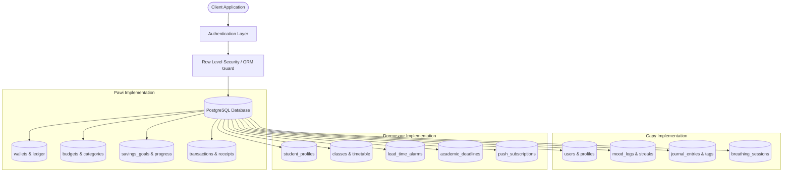

# PostgreSQL Database Architecture

> [!INFO] **Database Overview**
> **PostgreSQL** provides the ACID-compliant relational data foundation across all three application ecosystems, guaranteeing transactional integrity across financial ledgers, wellness records, and academic schedules.

---

## Architectural Paradigms Across Ecosystems

### 1. Pawi: Supabase PostgreSQL with Row Level Security (RLS)
- Declarative tenant isolation: every query enforces `auth.uid() = user_id`.
- Real-time subscription pipelines for instant multi-device balance reflections.

### 2. Capy: Prisma ORM over PostgreSQL
- Strictly typed database schemas and migration workflows (`prisma/schema.prisma`).
- Relational queries for mood analytics, streak aggregations, and wellness histories.

### 3. Dormosaur: Supabase PostgreSQL with Connection Pooling
- User-scoped timetable storage, dynamic alarm triggers, and deadline tracking.
- Web-push device token management (`endpoint`, `p256dh`, `auth`).

---

## Projects Implementing PostgreSQL
- [[Pawi — AI-Powered Personal Finance Tracker — Complete Project Architecture & Knowledge Base|Pawi: AI-Powered Personal Finance Tracker]] (Supabase PG 15 + RLS)
- [[Capy — Deep Project Architecture & System|Capy: Cozy AI Mood & Travel Companion]] (Prisma ORM + PostgreSQL)
- [[Dormosaur — AI-Powered Student Campus & Dorm Companion — Complete Project Architecture & Knowledge Base|Dormosaur: AI-Powered Student Campus & Dorm Companion]] (Supabase PG 15 + RLS)

---

## Related Hubs
- [[Next.js]]
- [[Artificial Intelligence & LLMs]]
- [[Home|Projects Dashboard]]
