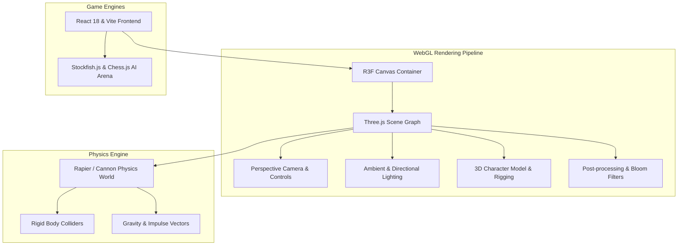

# Three.js & 3D Web Graphics Architecture

> [!INFO] **Technology Overview**
> Real-time 3D graphics and physics simulations in the browser using **WebGL**, **Three.js**, **React Three Fiber (@react-three/fiber)**, and the **Rapier** WebAssembly physics engine.

---

## Core 3D Architecture Stack

---

## Key Capabilities Implemented
1. **React Three Fiber (R3F)**: Declarative component-driven Three.js scene graphs integrated directly with React state and lifecycle hooks.
2. **WASM Physics (Rapier / Cannon)**: Real-time collision detection, bone ragdolls, and tactile particle physics.
3. **Smooth Motion Choreography**: Lenis virtual smooth scroll combined with GSAP scroll-triggered timeline animations.
4. **Post-Processing**: Depth of field, bloom, and chromatic aberration optimized for 60+ FPS on consumer GPUs.

---

## Projects Implementing 3D & WebGL
- [[Janver Manlapaz — 3D Interactive Developer Portfolio — Complete Project Architecture & Knowledge Base|Janver Manlapaz: 3D Interactive Developer Portfolio]]

---

## Related Hubs
- [[Tailwind CSS]]
- [[Home|Projects Dashboard]]
